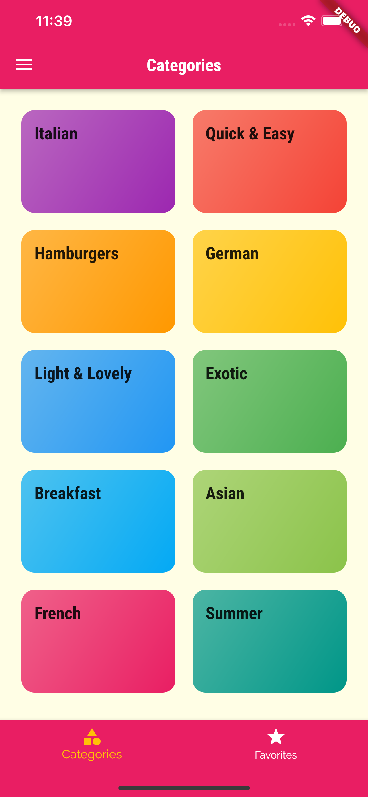
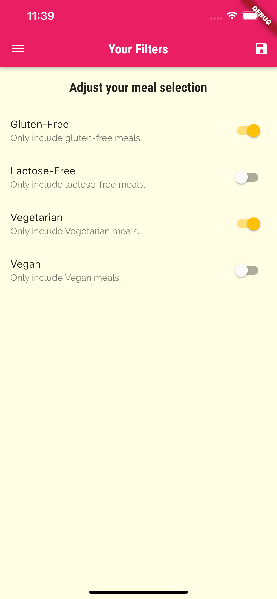
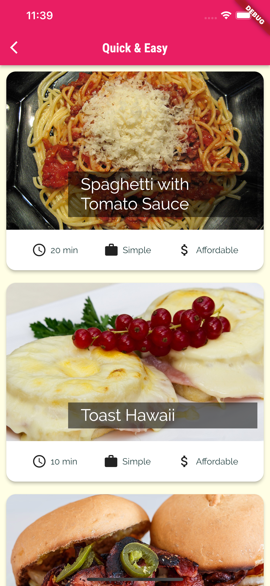

# Meals App

A Flutter application that was built while learning Navigation/Screen features in Flutter application development. Meals-App lets you browse meals by category, mark them as favorites and set filters to decide which type of meals you want. This application contains recipes too with a step by step guide.

This project contains the basic features that are required to build an amazing Flutter application.

## Images from the app

               